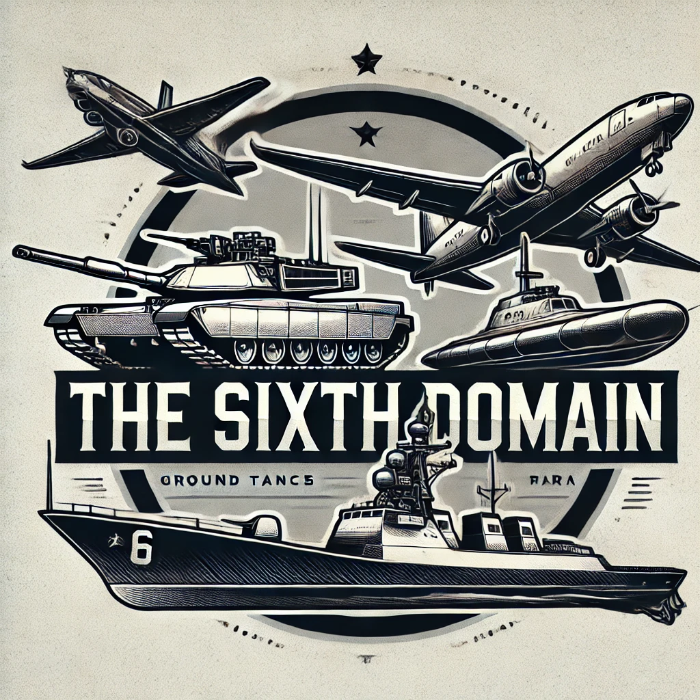

# thesixthdomaingodot
Simulation War Games "The Sixth Domain" based on Godot Open Source 3D Engine

## Library to use

### Oceans

- https://github.com/2Retr0/GodotOceanWaves
- https://github.com/godot-extended-libraries/godot-realistic-water
- https://stayathomedev.itch.io/infinite-ocean
- https://github.com/tessarakkt/godot4-oceanfft

### Sky

- https://stayathomedev.itch.io/godotsky (Only for Godot 4.0) 15$
- 

### 
- https://github.com/ueshita/godot-floatable-body
- https://github.com/saurus/Buoyancy
